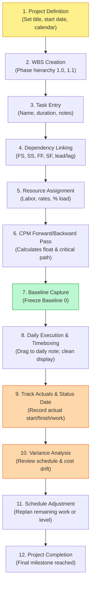

# Timebox v1.5 Product Roadmap & Strategic Evolution

**Date**: 2026-09-15  
**Baseline Version**: 1.4.0 (Protected Production Baseline)  
**Status**: Formal Product Roadmap & Architecture Strategy  

---

## 1. Executive Summary & Baseline Protection

With the release of **Timebox 1.4.0**, the application has established a proven, production-grade **professional project-management foundation** inside Obsidian. It features:
- A pure, 2-pass Critical Path Method (CPM) engine with early/late dates, total float, and free float.
- Support for all four dependency relationship types (`FS`, `SS`, `FF`, `SF`) with lead and lag offsets.
- Multi-level WBS task hierarchy, summary phase rollups, and milestone tracking.
- Resource directory with work/material/cost types, custom hours per day, hourly rates, and time-phased utilization matrices.
- Calendar engine supporting working days, custom hours, holidays, and exceptions.
- Versioned baselines (`Baseline 0`–`10`) and variance calculations.
- Strict presentation boundary isolation protecting daily notes and Timebox daily planning from project metadata pollution.
- High-throughput performance (1,000 tasks scheduled and analyzed in ~11ms; 5,000 tasks in ~119ms).

### Baseline Protection Directive
The Git commit and release tag `1.4.0` serve as the **protected production baseline**. Future development in the v1.5+ lifecycle must not rewrite, destabilize, or bypass the v1.4.0 architecture:
1. **Model Decoupling**: Core engines (`SchedulingEngine`, `ResourceEngine`, `ProjectValidator`, `MarkdownAdapter`, `ProjectCommandManager`) must remain pure TypeScript with zero Obsidian or DOM dependencies.
2. **Markdown Sovereignty**: The single source of truth remains plain-text Obsidian Markdown notes and YAML frontmatter. Proprietary binary storage or database sidecars are prohibited.
3. **Dual-Layer Principle**: Daily Timebox planning (clock/intraday level) and Project Management (day/CPM level) must remain strictly decoupled in presentation.

---

## 2. Capability Gap Analysis

Based on the [Project Management Capability Matrix](../qa/project-management-capability-matrix.md), every capability marked *Partially implemented*, *Planned*, or *Not implemented* has been evaluated against Timebox's design philosophy:

```mermaid
quadrantChart
    title Capability Prioritization Matrix
    x-axis Low Technical Complexity --> High Technical Complexity
    y-axis Low Strategic Alignment --> High Strategic Alignment
    quadrant-1 Essential (Core Focus v1.5)
    quadrant-2 High Value / Specialized (v1.6)
    quadrant-3 Not Aligned (Do Not Implement)
    quadrant-4 Fundamental Polish (Immediate v1.5)
    "Configurable Status Date": [0.25, 0.95]
    "Project Calendar UI": [0.28, 0.90]
    "Project Properties Modal": [0.20, 0.92]
    "Baseline Management UI": [0.22, 0.88]
    "Actuals Entry & Tracking": [0.45, 0.86]
    "Automated Resource Leveling": [0.82, 0.72]
    "Recurring Project Tasks": [0.55, 0.40]
    "Dedicated PERT View": [0.75, 0.35]
    "Earned Value (EVM)": [0.65, 0.30]
    "Sub-Day Hourly CPM": [0.90, 0.05]
```

### A. Essential Capabilities (Core v1.5 Focus)
*Features required for Timebox to function as a mature, complete project tracking and control system.*
1. **Configurable Status Date & Progress Period**:
   - Currently, schedule evaluation assumes "Today". Professional project control requires evaluating progress as of a specific reporting cut-off date (e.g. Friday close of business).
2. **Execution Tracking & Actuals**:
   - Entering `Actual Start`, `Actual Finish`, `Actual Duration`, and `Actual Work`, with engine recalculation of remaining duration and revised forecast finish dates.
3. **Fundamental Configuration UIs (Bridging Engine to User)**:
   - The v1.4.0 engine supports multiple calendars, constraints, task types, and baselines, but users currently lack visual dialogs to configure project-level calendars, active baselines, and project properties. Building these UIs is the highest-leverage v1.5 deliverable.

### B. Valuable Capabilities (v1.6 Candidates)
*Features that enhance convenience or optimization, but are not strictly necessary for core execution.*
1. **Automated Resource Leveling**:
   - Algorithmic shifting of non-critical tasks within available total float to eliminate resource over-allocations. (Manual leveling via Gantt drag-and-drop is currently fully supported).
2. **Arbitrary Multiple Baselines Management UI**:
   - Switching active baseline comparisons between `Baseline 0` (initial approved) and subsequent re-baselines (`Baseline 1`, `Baseline 2`).
3. **Advanced Cost & Budget Tracking**:
   - Actual Cost of Work Performed (ACWP) calculations compared against baseline budget.

### C. Specialized Capabilities (Future Roadmap / Post-v1.6)
*Advanced features valuable for niche project offices but outside general user needs.*
1. **Earned Value Management (EVM)**:
   - Formal calculations of Planned Value (PV), Earned Value (EV), Actual Cost (AC), Cost Performance Index (CPI), and Schedule Performance Index (SPI).
2. **Dedicated PERT / Network Diagram View**:
   - Interactive node-and-link dependency graph. (Gantt dependency arrows currently provide relationship visibility).

### D. Capabilities Not Aligned with Timebox Philosophy (Do Not Implement)
*Features that belong in enterprise ERP systems or conflict with Timebox's Obsidian-native focus.*
1. **Sub-Day Fractional CPM Scheduling**:
   - Hourly network dependency calculations (e.g. task B starts 3.5 hours after task A) fragment calendars and destabilize daily planning. Macro scheduling belongs in days; micro scheduling belongs in Timebox daily notes.
2. **Multi-User Real-Time Resource Contention Locking**:
   - Obsidian is a local-first personal knowledge management environment. Cloud-based multi-user checkout locks conflict with local Markdown sovereignty.
3. **Bloated Complex Toolbars & Ribbon Interfaces**:
   - Timebox rejects dense, 5-tier Microsoft Office ribbons in favor of focused, contextual view switches.

---

## 3. Deep-Dive Evaluation of Major Candidate Capabilities

### 3.1 Actuals & Configurable Status Date (Recommended for v1.5)
In v1.4.0, task actuals (`actualStart`, `actualFinish`, `actualWork`) exist in the TypeScript interfaces but cannot be recorded through an interactive workflow.
- **Workflow**:
  1. The project manager sets a **Status Date** (e.g., `2026-10-02`).
  2. For in-progress tasks, entering `Actual Start` locks the start date.
  3. Setting `% Complete` or `Actual Work` automatically computes remaining duration:
     $$\text{Remaining Duration} = \text{Planned Duration} \times (1 - \text{Percent Complete})$$
  4. Incomplete work on past dates is automatically shifted to resume on or after the Status Date.
  5. For completed tasks, entering `Actual Finish` freezes the task duration and removes it from future critical path calculations.

### 3.2 Automated Resource Leveling (Recommended for v1.6)
Automated leveling is often misunderstood as a simple "shift tasks forward until red goes away" routine. In real-world projects, naive leveling destroys schedules:
- **Leveling Trade-offs**:
  - **Schedule Slippage**: Leveling inevitably extends project duration unless tasks have substantial free float.
  - **Milestone Invalidation**: Fixed contractual milestones can be violated if successor tasks are pushed indiscriminately.
  - **Splitting vs Non-Splitting**: Deciding whether tasks can be interrupted over weekends or resource gaps.
- **Strategy for Timebox**:
  - Rather than an automatic, non-consensual background leveling loop, Timebox should implement a **Guided Leveling Advisor**:
    1. Scan the project for over-allocated dates using `ResourceEngine.detectOverAllocations()`.
    2. Identify tasks with positive `totalFloat` scheduled during the conflict window.
    3. Calculate the minimal delay required to bring peak daily allocation $\le \text{Capacity}$.
    4. Surface the proposed shift in a preview modal: *"Shift task 'Secondary Trenching' by 2 working days? This uses 2d of 5d available float without delaying the project finish."*
    5. Allow the user to accept, modify, or reject the leveling recommendation.

### 3.3 Recurring Project Tasks vs Daily Timebox Rollover
A common confusion is whether project management needs a separate "Recurring Task" engine.
- **Clear Distinction**:
  - **Timebox Daily Rollover**: Personal habits, operational routines, and daily rituals (e.g. "Morning Standup", "Review Inbox"). These live in daily notes and carry over day-to-day.
  - **Project Recurring Tasks**: Contractual activities tied to project execution (e.g. "Weekly Municipal Inspection every Thursday for 8 weeks", "Monthly Progress Billing").
- **Recommendation**:
  - Do **not** build a separate background cron or recurring daemon for Gantt tasks.
  - Provide a **Generate Recurring Task Series** command in the Task Sheet that expands a recurrence rule into discrete WBS subtasks under a dedicated summary phase (e.g., `1.5 Weekly Site Safety Audits` $\rightarrow$ `1.5.1 Audit Week 1`, `1.5.2 Audit Week 2`, etc.). This preserves transparent CPM scheduling without phantom background states.

### 3.4 Dedicated PERT / Network Diagram View
- **Evaluation**:
  - PERT diagrams are occasionally requested by project management purists, but practical project managers spend the vast majority of their time in the Gantt and Task Sheet views.
  - Because Timebox already renders interactive dependency arrows on the Gantt canvas with critical path highlighting, a standalone node-link PERT diagram is a secondary visualization.
- **Recommendation**: Defer to **v1.6 or v2.0** as a specialized analytical view.

### 3.5 Advanced Cost Management & Earned Value Management (EVM)
- **Evaluation**:
  - Basic cost modeling (`ratePerHour`, `costPerUse`, total cost rollups) is already functional in v1.4.0.
  - Full EVM (PV, EV, AC, CPI, SPI) requires historical cost recording at multiple status date intervals.
- **Recommendation**:
  - In v1.5, provide **Cost & Budget Visibility** in the Task Sheet and Project Summary (Planned Cost vs Baseline Cost variance).
  - EVM trend curve visualization should be considered an advanced add-on for **v1.6+**.

---

## 4. Professional Project Management Workflow Definition

The end-to-end lifecycle in Timebox is mapped below to existing features and identified v1.5 gap closures:



| Lifecycle Step | Timebox v1.4.0 Status | v1.5 Enhancement Needed |
| :--- | :---: | :--- |
| **1. Project Definition** | Frontmatter editing | **Project Settings Modal**: Configure project start date, calendar, deadline. |
| **2. WBS Creation** | Indentation / hotkeys | Fully functional. |
| **3. Task Entry** | Task Sheet / Inline | Add explicit Task Type (Fixed Duration/Work) and Deadline picker. |
| **4. Dependency Linking** | Gantt drag & inline syntax | Fully functional. |
| **5. Resource Assignment** | Resource Sheet / Modals | Add resource calendar assignment dropdown in Resource Modal. |
| **6. CPM Scheduling** | 2-Pass Engine | Fully functional (identifies zero-float critical path). |
| **7. Baseline Capture** | Frontmatter / Command | **Baseline Management Dialog**: One-click "Save Baseline", view captured date. |
| **8. Daily Timeboxing** | Daily Note drag / sync | Fully functional (presentation isolation protects daily note). |
| **9. Track Actuals** | Model properties only | **Actuals Entry UI & Status Date**: Record actual dates/hours; shift late work. |
| **10. Variance Analysis** | Model calculations | **Variance Columns & Summary Cards**: Display schedule/cost variance. |
| **11. Schedule Adjustment** | Drag-to-shift / Undo-Redo | Guided Leveling Advisor (v1.6). |
| **12. Project Completion** | Checkbox completion | Fully functional. |

---

## 5. Prioritized Product Roadmap

| Capability | Category | User Value | Technical Complexity | Core Dependencies | Target Version |
| :--- | :---: | :---: | :---: | :--- | :---: |
| **Project Settings & Calendar UI** | Essential | **High** | Low | None (uses existing engine) | **v1.5.0** |
| **Status Date & Actuals Workflow** | Essential | **High** | Medium | CPM Scheduling Engine | **v1.5.0** |
| **Baseline Management UI** | Essential | **High** | Low | Baseline snapshot engine | **v1.5.0** |
| **Variance Reporting in Views** | Essential | **Medium** | Low | Status Date & Baselines | **v1.5.0** |
| **Task Sheet Column Customization** | Valuable | **Medium** | Low | Task Sheet table renderer | **v1.5.1** |
| **Guided Resource Leveling Advisor**| Valuable | **High** | High | ResourceEngine, Float math | **v1.6.0** |
| **Recurring Task Series Generator** | Valuable | **Medium** | Medium | WBS expansion engine | **v1.6.0** |
| **Cost & EVM Analytical Charts** | Specialized | **Medium** | High | Baseline tracking, Status Date | **v1.6.0** |
| **Dedicated Interactive PERT View** | Specialized | **Low** | High | SVG layout engine, Graph layout | **v2.0** |
| **Sub-Day Hourly CPM Engine** | Not Aligned | **Low** | Very High | Calendar fragmentation | **Rejected** |

---

## 6. The v1.5 Focused Scope: 4 Core Pillars

To ensure maximum software reliability, release quality, and zero regressions, **v1.5 is strictly bounded to four cohesive pillars**:

### Pillar 1: Project Settings & Calendar Management UI
- **Objective**: Expose the existing calendar and project engine configurations through an intuitive settings modal.
- **Features**:
  - `Project Settings Modal`: Edit Project Title, Project Start Date, Project Deadline, Schedule Mode (Forward/Backward), and Active Calendar.
  - `Calendar Configuration Modal`: Edit standard weekly working days (e.g. toggle Sunday–Saturday), default hours per day, and holiday exception dates.
  - `Task Calendar Override`: Allow tasks to select a specific calendar from project calendars.

### Pillar 2: Configurable Status Date & Actuals Tracking
- **Objective**: Turn Timebox from a static planning tool into an active project execution and tracking system.
- **Features**:
  - `Status Date Picker`: Configurable project status cut-off date with a distinctive vertical marker line on the Gantt timeline.
  - `Actual Dates & Work Entry`: Task modal fields for `Actual Start`, `Actual Finish`, and `Actual Work (h)`.
  - `Execution Forecast`: Unfinished work prior to the status date automatically ripples forward to the status date.

### Pillar 3: Baseline Management & Variance UI
- **Objective**: Allow project managers to freeze, manage, and visually audit schedule slippage against initial commitments.
- **Features**:
  - `Baseline Manager`: Save `Baseline 0` (Initial Approval) or additional snapshots (`Baseline 1`...); view capture timestamp, work, and cost.
  - `Active Baseline Comparison Selector`: Switch which baseline is compared on the Gantt and Task Sheet.
  - `Variance Reporting`: Task Sheet variance columns (`Start Var`, `Finish Var`, `Work Var`, `Cost Var`).

### Pillar 4: Task Sheet & View Polish
- **Objective**: Improve day-to-day data entry ergonomics.
- **Features**:
  - Column toggle visibility menu in Task Sheet (hide/show WBS, Predecessors, Resources, Baseline, Variances).
  - Quick-action buttons in Task Sheet header for `Status Date`, `Baselines`, and `Settings`.
  - Polished keyboard navigation (`Tab` / `Shift+Tab` across editable table cells).

---

## 7. Answers to Core Strategic Questions

### 1. What should v1.5 actually contain?
v1.5 should contain **Pillars 1 through 4**: Project Settings UI, Calendar Editing UI, Configurable Status Date, Actuals Entry, Baseline Management UI, and Variance Columns. This delivers a complete, professional execution-tracking lifecycle without touching high-risk heuristic algorithms.

### 2. What should wait?
- **Automated Resource Leveling**: Scheduled for **v1.6**. Manual leveling via Gantt drag-to-shift with instant over-allocation highlighting already satisfies v1.4.0/v1.5 needs.
- **Recurring Task Series Generator**: Scheduled for **v1.6**.
- **Dedicated PERT View**: Scheduled for **v2.0**.
- **Earned Value Management (EVM)**: Scheduled for **v1.6+**.

### 3. What should NEVER be implemented because it conflicts with Timebox?
- **Sub-Day Fractional CPM Engine**: Intraday minute scheduling destroys project calendar clarity and belongs in Timebox daily notes.
- **Multi-Tenant Server-Side Locking**: Conflicts with Obsidian's local-first Markdown philosophy.
- **Proprietary Sidecar Databases (SQLite/JSON blobs for task data)**: All project data must remain strictly human-readable Markdown and YAML frontmatter.

### 4. Are any architectural changes required?
**No architectural rewrite is required.** The normalized project model designed in v1.4.0 (`NormalizedProject`, `NormalizedTask`, `CalendarDefinition`, `ProjectBaseline`) already anticipated these fields. Only user-facing modal dialogs, frontmatter key serialization, and view-layer columns need to be added.

### 5. What is the safest implementation order for v1.5?
1. **Phase 1: Project Settings & Calendar Configuration UI** (Low risk, bridges existing engine capabilities).
2. **Phase 2: Baseline Management & Variance Reporting** (Low risk, visual and state snapshots).
3. **Phase 3: Configurable Status Date & Actuals Tracking** (Medium risk, touches forward forecast ripple math).
4. **Phase 4: Task Sheet Column Customization & View Ergonomics** (Low risk, UI presentation).
5. **Phase 5: Real-World 50+ Task Regression & Acceptance Suite** (Zero defect verification before release).
