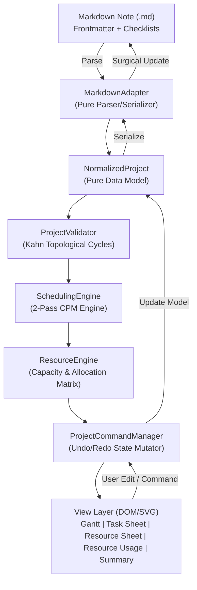
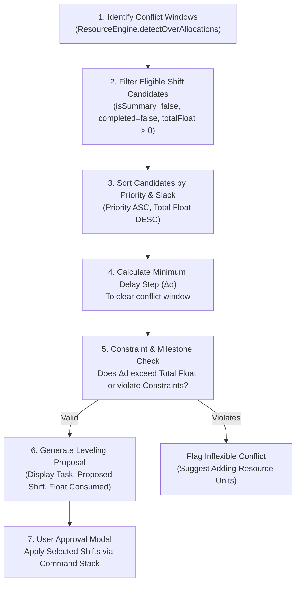
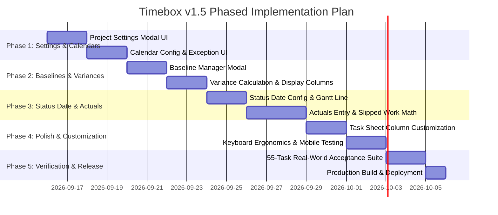

# Timebox v1.5 Technical Architecture & Design Document

**Date**: 2026-09-15  
**Baseline Version**: 1.4.0  
**Target Release**: 1.5.0  
**Status**: Technical Architecture & Design Specification  

---

## 1. Architecture Continuity & Non-Destructive Extension

Timebox 1.5 builds directly upon the proven, decoupled architecture established in v1.4.0. No architectural layer is rewritten or replaced:



### Core Invariants Maintained
1. **Zero UI Imports in Engines**: `SchedulingEngine`, `ResourceEngine`, `ProjectValidator`, `ProjectCalendar`, and `ProjectCommandManager` remain 100% decoupled from Obsidian and browser DOM APIs.
2. **Lossless Surgical Serialization**: `MarkdownAdapter.serializeProject` preserves user prose, wikilinks, callouts, and comments verbatim.
3. **Dual Presentation Boundary**: `stripProjectMetadata` continues to prevent PM metadata tokens (`🛫`, `📅`, `⏳`, `dependsOn`, `@resource`, `[%::]`, `[constraint::]`) from cluttering daily note views.
4. **Zero-Migration Backward Compatibility**: All v1.5 schema additions are strictly optional and carry deterministic defaults. Any note created in v1.4.0 or earlier opens without schema upgrade prompts or file mutation.

---

## 2. Technical Design: Pillar 1 — Project Settings & Calendar Management

### 2.1 Project Settings Modal (`ProjectSettingsModal`)
Provides an executive configuration dialog accessible via the project header gear icon (`⚙ Settings`).

```typescript
export interface ProjectSettingsFormData {
    name: string;
    projectStartDate: string;
    projectDeadline?: string;
    schedulingDirection: 'forward' | 'backward';
    activeCalendarId: string;
    startTaskNumber: number; // 1 = First task is 1; 2 = Title task is 1
}
```

#### Frontmatter Serialization
```yaml
---
title: Commercial Facility Buildout
projectStartDate: 2026-09-14
deadline: 2026-12-15
scheduleMode: forward
activeCalendarId: standard
startTaskNumber: 1
---
```

### 2.2 Calendar Configuration Dialog (`CalendarConfigModal`)
Allows users to visually configure project calendars without editing raw YAML arrays.

```typescript
export interface CalendarEditFormData {
    id: string;
    name: string;
    workingDays: number[]; // e.g. [1, 2, 3, 4, 5] for Mon-Fri
    hoursPerDay: number;   // e.g. 8
    holidays: string[];    // e.g. ["2026-10-12", "2026-11-26"]
    exceptions?: CalendarException[];
}
```

#### UI Behavior
- **Weekly Working Days Selector**: 7 visual toggle pills (Sun, Mon, Tue, Wed, Thu, Fri, Sat). Toggling updates the `workingDays` array in `ProjectCalendar`.
- **Hours Per Working Day**: Numeric input (default 8, supports custom standard like 7.5 or 4 for part-time calendars).
- **Holidays Manager**: Add/remove holiday dates via native date picker with instant validation.
- **Calendar Inheritance**: Resources can select any defined project calendar via `calendarId`.

---

## 3. Technical Design: Pillar 2 — Configurable Status Date & Actuals Tracking

### 3.1 Configurable Status Date Architecture
In v1.4.0, progress evaluation is implicitly anchored to the user's current date ("Today"). In v1.5.0, projects can declare an explicit **Status Date** representing the reporting period cut-off.

```typescript
// projectModel.ts extension
export interface NormalizedProject {
    // Existing fields...
    statusDate?: string; // YYYY-MM-DD reporting cut-off date
}
```

#### Frontmatter Schema
```yaml
---
statusDate: 2026-10-02
---
```

#### Gantt Visualization
- When `statusDate` is defined, a vertical blue dashed reference line with a `STATUS DATE (YYYY-MM-DD)` badge is rendered across the timeline SVG canvas.
- A toggle button `📍 Status Date` in the Gantt toolbar allows instant jumping to the status line.

---

### 3.2 Task Actuals & Remaining Duration Mathematical Model

#### A. Data Model Extension
```typescript
// projectModel.ts extension
export interface NormalizedTask {
    // Existing fields...
    actualStart?: string;      // YYYY-MM-DD
    actualFinish?: string;     // YYYY-MM-DD
    actualDurationDays?: number;
    actualWorkHours?: number;
    remainingDurationDays?: number;
    remainingWorkHours?: number;
}
```

#### B. Markdown Token Representation
```markdown
- [x] Sub-surface Core Sample Extraction 🛫 2026-09-14 📅 2026-09-15 ⏳ 2d [actualStart:: 2026-09-14] [actualFinish:: 2026-09-16]
- [ ] Excavation & Utility Trenching 🛫 2026-09-30 📅 2026-10-09 ⏳ 8d [%:: 50] [actualStart:: 2026-09-30] [actualWork:: 32h]
```

#### C. Execution Tracking Calculation Algorithm
During `SchedulingEngine.schedule(project)`:

1. **Completed Tasks (`task.completed === true` or `percentComplete === 100`)**:
   - If `actualStart` is missing, default to `calculatedStart`.
   - If `actualFinish` is missing, default to `calculatedFinish`.
   - Freeze the task duration to actual duration:
     $$\text{actualDurationDays} = \text{calendar.calculateWorkingDays}(\text{actualStart}, \text{actualFinish})$$
   - Successors calculate their start dates based on `actualFinish`.

2. **In-Progress Tasks (`0 < percentComplete < 100`)**:
   - Lock `calculatedStart = actualStart` (user-recorded actual start date).
   - Calculate completed work:
     $$\text{completedWorkHours} = \text{task.workHours} \times \left(\frac{\text{percentComplete}}{100}\right)$$
   - Calculate remaining working days:
     $$\text{remainingDurationDays} = \max\left(1, \text{Math.ceil}\left(\text{task.durationDays} \times \left(1 - \frac{\text{percentComplete}}{100}\right)\right)\right)$$
   - **Progress Line Slipped Work Forecast**:
     If `project.statusDate` is set, and the task finish date slipped behind the status date while remaining incomplete, the remaining work is scheduled to start on the nearest working day after the status date:
     $$\text{forecastStart} = \max\left(\text{earliestStart}, \text{calendar.snapToWorkingDay}(\text{project.statusDate}, \text{'forward'})\right)$$
     $$\text{calculatedFinish} = \text{calendar.addWorkingDays}(\text{forecastStart}, \text{remainingDurationDays})$$

3. **Unstarted Tasks with Passed Dates (`percentComplete === 0` and `calculatedStart < statusDate`)**:
   - The engine flags a warning: `TASK_START_OVERDUE`.
   - If auto-forecasting is enabled, start date is pushed to `statusDate`.

---

## 4. Technical Design: Pillar 3 — Baseline Management & Variance Reporting

### 4.1 Multi-Baseline Snapshot Schema
The v1.4.0 baseline schema already supports versioned dictionaries. v1.5.0 adds formal active baseline switching and metadata management:

```yaml
activeBaselineId: "0"
baselines:
  "0":
    id: "0"
    name: "Baseline 0 (Initial Approval)"
    savedAt: 2026-09-10T14:00:00.000Z
    totalWorkHours: 1240
    totalCost: 115600
    tasks:
      "1.1.1.1.1":
        start: 2026-09-14
        finish: 2026-09-15
        duration: 2
        work: 16
        cost: 1760
  "1":
    id: "1"
    name: "Baseline 1 (Post-Permit Re-alignment)"
    savedAt: 2026-10-01T09:30:00.000Z
    totalWorkHours: 1320
    totalCost: 122400
    tasks: ...
```

### 4.2 Baseline Manager Dialog (`BaselineModal`)
- **Actions**:
  - `Save New Baseline`: Captures the current active schedule as a new baseline ID (`0`, `1`, `2`...) with user-defined descriptive name.
  - `Set Active Baseline`: Dropdown selecting which baseline drives comparison bars and variance columns.
  - `Delete Baseline`: Removes an obsolete baseline snapshot.
- **Commands**:
  - Encapsulated via `CaptureBaselineCommand` and `SetActiveBaselineCommand` for full Undo/Redo reversibility.

### 4.3 Variance Calculation Engine
When an active baseline is selected:
```typescript
// schedulingEngine.ts variance computation
if (activeBaseline && activeBaseline.tasks[taskWbsOrId]) {
    const b = activeBaseline.tasks[taskWbsOrId];
    task.variance = {
        startVariance: calendar.calculateWorkingDays(b.start, task.calculatedStart) - 1,
        finishVariance: calendar.calculateWorkingDays(b.finish, task.calculatedFinish) - 1,
        durationVariance: task.durationDays - b.duration,
        workVariance: task.workHours - b.work,
        costVariance: task.cost - b.cost
    };
}
```

### 4.4 Task Sheet Variance Columns
Task Sheet headers gain optional variance columns with color-coded drift indicators:
- `Start Var`: Green if $\le 0$, Red if $> 0$ (delayed).
- `Finish Var`: Green if $\le 0$, Red if $> 0$ (project slippage).
- `Cost Var`: Red if actual/planned cost exceeds baseline budget.

---

## 5. Technical Design: Pillar 4 — Task Sheet Customization & View Ergonomics

### 5.1 Column Visibility Controller (`TaskSheetColumnConfig`)
Allows users to tailor the Task Sheet to their immediate role (e.g. Estimator vs Scheduler vs Field Tech):

```typescript
export interface TaskSheetColumn {
    id: string;
    label: string;
    width: number;
    visible: boolean;
    category: 'core' | 'schedule' | 'resources' | 'baseline' | 'actuals';
}

export const DEFAULT_COLUMNS: TaskSheetColumn[] = [
    { id: 'wbs', label: 'WBS', width: 60, visible: true, category: 'core' },
    { id: 'title', label: 'Task Name', width: 260, visible: true, category: 'core' },
    { id: 'duration', label: 'Duration', width: 80, visible: true, category: 'schedule' },
    { id: 'start', label: 'Start', width: 100, visible: true, category: 'schedule' },
    { id: 'finish', label: 'Finish', width: 100, visible: true, category: 'schedule' },
    { id: 'predecessors', label: 'Predecessors', width: 120, visible: true, category: 'schedule' },
    { id: 'resources', label: 'Resources', width: 140, visible: true, category: 'resources' },
    { id: 'percent', label: '% Complete', width: 90, visible: true, category: 'core' },
    { id: 'baselineStart', label: 'Baseline Start', width: 100, visible: false, category: 'baseline' },
    { id: 'baselineFinish', label: 'Baseline Finish', width: 100, visible: false, category: 'baseline' },
    { id: 'finishVar', label: 'Finish Var', width: 80, visible: false, category: 'baseline' },
    { id: 'actualStart', label: 'Actual Start', width: 100, visible: false, category: 'actuals' },
    { id: 'actualFinish', label: 'Actual Finish', width: 100, visible: false, category: 'actuals' },
    { id: 'cost', label: 'Cost', width: 90, visible: false, category: 'resources' }
];
```

The user's column visibility preferences are stored in Obsidian Plugin settings (`TimeboxSettings.taskSheetColumns`), preserving layout across sessions.

---

## 6. Technical Evaluation: Automated Resource Leveling Strategy (v1.6 Preparation)

### 6.1 The Mathematical Challenge of Heuristic Leveling
Resource leveling is a non-linear, NP-hard bin-packing problem constrained by a Directed Acyclic Graph (DAG). 

A naive algorithm that pushes any conflicting task forward until its daily load drops creates severe project failure modes:
1. **Critical Path Inflation**: Pushing a task with zero float directly extends the overall project deadline.
2. **Milestone Breaches**: Pushing tasks past fixed constraints (`[constraint:: mfo]`) violates contractual commitments.
3. **Cascading Ripple**: Shifting Task A out of a conflict on Monday may create an even worse 3-way collision on Thursday.

### 6.2 The Timebox Guided Leveling Algorithm Design
Rather than executing opaque background mutations, Timebox v1.6 will implement the **Min-Slack Heuristic Advisor**:



#### Leveling Rules
- **Rule 1 (Critical Path Preservation)**: Never propose shifting a critical task (`isCritical === true` or `totalFloat <= 0`) unless the user explicitly checks *"Allow Project Finish Delay"*.
- **Rule 2 (Float Bounded)**: Maximum proposed shift $\Delta d \le \text{task.totalFloat}$.
- **Rule 3 (Milestone Invariance)**: Tasks with `#milestone` or $0\text{d}$ duration are immutable to leveling shifts.
- **Rule 4 (Undo Reversibility)**: All leveling shifts execute as a single atomic `BatchCommand`, allowing instant one-click Undo (`Ctrl+Z`).

---

## 7. Technical Evaluation: Recurring Tasks & Network Diagrams

### 7.1 Recurring Project Task Series Generator
- **Approach**: Dedicated UI modal in the Task Sheet: `Create Recurring Task Series`.
- **Inputs**: Task Title, Recurrence (Daily, Weekly on specific days, Monthly), Duration, Work per occurrence, Resource assignment, Number of occurrences or End Date.
- **Output**: Generates real, explicit WBS subtasks in Markdown under a summary task:
  ```markdown
  - [ ] 1.5 Weekly Site Safety Audits 🛫 2026-09-17 📅 2026-11-05 ⏳ 8d
    - [ ] 1.5.1 Site Safety Audit - Week 1 🛫 2026-09-17 📅 2026-09-17 ⏳ 1d @carol-insp
    - [ ] 1.5.2 Site Safety Audit - Week 2 🛫 2026-09-24 📅 2026-09-24 ⏳ 1d dependsOn:: 1.5.1FS+4d @carol-insp
    ...
  ```
- **Benefit**: Retains 100% transparent CPM scheduling without inventing hidden recurrence daemons.

### 7.2 Dedicated PERT / Network Diagram View Evaluation
- **Analysis**: A standalone node-and-link PERT chart requires an asynchronous graph layout engine (e.g. Dagre or Cytoscape) to position nodes without edge overlapping.
- **Performance Trade-off**: Layout calculation for 1,000 nodes takes 300–500ms and renders 4,000+ DOM nodes, compared to the ultra-fast linear SVG Gantt canvas (11ms).
- **Decision**: Defer to **v2.0**. The Gantt dependency arrows and critical path highlight provide effective dependency auditing for common project workflows.

---

## 8. Performance Budgets & Virtualization Architecture

Timebox 1.4.0 already achieves exceptional calculation performance:
- 100 Tasks: **1.1 ms**
- 1,000 Tasks: **11.2 ms**
- 5,000 Tasks: **118.8 ms**

### The 10,000-Task Performance Plan
As project scale reaches 10,000 tasks, the bottleneck is never the CPM scheduling engine (which scales as $O(V + E)$ topological sort), but rather the **DOM / SVG element count**:
- 10,000 tasks rendered simultaneously in HTML/SVG generate over 50,000 DOM nodes, degrading browser scroll FPS.

#### Virtual Windowing Strategy (v1.5 / v1.6)
For the Task Sheet and Gantt row renderer:
1. Measure viewport container height (e.g. 800px).
2. Given row height $h = 32\text{px}$, calculate visible row capacity: $N = \lceil 800 / 32 \rceil + 5 \approx 30\text{ rows}$.
3. Listen to container `scroll` event with `requestAnimationFrame`.
4. Render only rows between index $i_{\text{start}} = \lfloor \text{scrollTop} / 32 \rfloor - 2$ and $i_{\text{end}} = i_{\text{start}} + N + 4$.
5. Use top/bottom spacer divs with heights matching unrendered rows.
- **Result**: Renders only ~35 DOM nodes regardless of whether the project contains 100 or 10,000 tasks, maintaining a locked **60 FPS** scroll performance.

---

## 9. Implementation Roadmap & Phased Execution Plan



### Risk Assessment & Mitigation
| Implementation Area | Potential Risk | Mitigation Strategy |
| :--- | :--- | :--- |
| **Status Date Math** | Pushing incomplete tasks might create unintended cycle or float errors. | Slipped work forecasting only shifts tasks with `calculatedStart < statusDate` and re-runs the topological validator. |
| **Frontmatter Growth** | Saving multiple baselines could enlarge YAML frontmatter. | Frontmatter only serializes changed baseline deltas or compact taskId-to-date mappings; tasks without baseline are omitted. |
| **Mobile Modals** | Complex calendar editing dialogs could overflow on mobile viewports. | Responsive modal CSS (`mod-timebox`) with touch-friendly 44px toggle buttons and full-width stacking. |

---

## 10. Architectural Declaration

> The v1.5 architecture design respects the core tenets of Timebox: **local Markdown sovereignty**, **pristine daily timebox isolation**, and **high-performance Critical Path Method scheduling**. By closing configuration UX gaps and completing the actuals execution loop, Timebox v1.5 establishes a complete, enterprise-grade project management system native to Obsidian.
