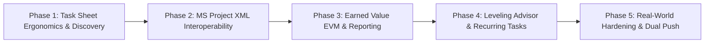

# Timebox v1.6 Strategic Discovery & Product Architecture

**Date**: 2026-09-16  
**Baseline Version**: Timebox 1.5.0 (Frozen Production Baseline)  
**Status**: Formal Product Discovery & Strategic Roadmap  
**Target Milestone**: Timebox v1.6 — The Professional Project Management Application  

---

## 1. Executive Summary

With the successful completion and hardening of **Timebox 1.5.0**, the platform has established a verified **Professional Project Management Foundation** within Obsidian. Timebox 1.5.0 maintains an immutable four-state execution lifecycle:

$$\text{Baseline} \longrightarrow \text{Current Planned Schedule} \longrightarrow \text{Actual Execution} \longrightarrow \text{Forecast}$$

The purpose of this discovery phase is to define the strategic trajectory that will transition Timebox from an engine-sound foundation into a **complete, daily-driver desktop Project Management Application** comparable to standalone desktop tools like Microsoft Project, ProjectLibre, and OmniPlan, while maintaining the simplicity, elegance, and personal workflow focus of Obsidian.

### The Guiding Principle: The Dual-Layer Architecture
Timebox operates across two distinct, complementary layers:

```mermaid
graph TD
    subgraph Macro Layer: Project Management
        A[Project Note: YAML Frontmatter & Tasks]
        B[CPM Engine: Forward/Backward Pass]
        C[Multi-Baselines & Variance Analysis]
        D[Forecast Engine & Status Date]
        E[Resource Workload & Over-Allocation]
    end

    subgraph The Clean Bridge
        F[stripProjectMetadata / Isolation]
        G[One-Click Injection: '+ Today']
        H[Bi-Directional Checkbox Sync: '- [x]']
    end

    subgraph Micro Layer: Timebox Daily Execution
        I[Daily Note: Focus Blocks]
        J[Intraday Clock Schedule: Morning/Afternoon]
        K[Brain Dump & Daily Rollover]
        L[Personal Execution Experience]
    end

    A --> B --> C --> D --> E
    E --> F --> G --> I
    I --> J --> K --> L
    L --> H --> A
```

Future architecture must strengthen the bridge between these layers without allowing macro PM complexity to clutter personal daily execution.

---

## 2. Current v1.5 Capability Baseline

Timebox 1.5.0 provides a frozen, validated production baseline:
- **Two-Pass CPM Engine**: Forward pass (Early dates) and backward pass (Late dates), Total Float, Free Float, and Critical Path highlighting.
- **Topological Dependencies**: All 4 standard relationship types (`FS`, `SS`, `FF`, `SF`) with positive and negative working-day lag/lead offsets.
- **Calendar Engine**: Custom working days (e.g. 4-day workweeks), custom daily working hours, project holidays list, and individual working exceptions.
- **Multi-Baseline Management**: Support for `Baseline 0` through `Baseline 10` snapshots, immutable YAML persistence, and signed variance math (`startVariance`, `finishVariance`, `durationVariance`, `workVariance`, `costVariance`).
- **Execution Tracking & Actuals**: Empirical actuals (`actualStart`, `actualFinish`, `actualWork`, `actualDuration`) isolated from planned dates.
- **Status Date & Forecast Engine**: 6-scenario forecast projection anchored from a configurable `statusDate` forward without overwriting user plans.
- **Five Native PM Views**: Interactive SVG Gantt Chart, Customizable Task Sheet (18 columns), Resource Sheet, Time-Phased Resource Usage Grid, and Executive Project Summary Dashboard.
- **Obsidian Integration**: Plain-text checklist persistence, wikilinks, tags, full undo/redo command stack, and presentation boundary isolation.

---

## 3. Capability Gap Analysis Summary

Based on the 30-domain benchmark detailed in [v1.6 Capability Gap Analysis](file:///Volumes/1TBDock/ZS-Projects/Obsidian/timebox-plugin/O-Timebox-Daily/docs/roadmap/v1.6-capability-gap-analysis.md), the system's capabilities are categorized as follows:

| Classification | Count | Description |
|:---|:---:|:---|
| **IMPLEMENTED** | **88** | Core desktop scheduling, dependencies, resources, baselines, actuals, and views. |
| **PARTIAL** | **15** | Capabilities where engine data models exist but UI workflows require completion. |
| **MISSING** | **22** | Desktop PM capabilities to be prioritized for v1.6 and v1.7. |
| **NOT APPLICABLE** | **5** | Capabilities intentionally rejected to protect local-first Markdown principles. |

---

## 4. Missing Professional PM Capabilities

To function as a mature desktop project management application, Timebox currently lacks several critical workflow capabilities:

1. **Task Sheet Filtering, Search & Grouping**:
   - *Problem*: In projects exceeding 50 tasks, finding tasks assigned to a specific contractor, identifying all slipped tasks, or isolating milestone checkpoints requires manual table scanning.
   - *Impact*: High friction during progress meetings and daily status audits.
2. **Industry-Standard File Interoperability (MS Project XML Import / Export)**:
   - *Problem*: Timebox is isolated within Obsidian. Users cannot import client schedules from Microsoft Project / ProjectLibre, nor export project schedules for stakeholders who do not use Obsidian.
   - *Impact*: Blocks Timebox adoption in commercial contracts requiring standard schedule submittals.
3. **Earned Value Management (EVM)**:
   - *Problem*: Traditional cost variance provides static budget deltas, but does not provide objective performance indexes ($CPI$, $SPI$) or cost forecasting ($EAC$).
   - *Impact*: Lacks standardized executive project controls expected by certified Project Management Professionals (PMPs).
4. **Guided Resource Leveling Advisor**:
   - *Problem*: When over-allocations occur, the project manager must manually inspect dates and floats to decide which tasks to delay.
   - *Impact*: Time-consuming conflict resolution in resource-constrained environments.
5. **One-Click Markdown Status Report Generator**:
   - *Problem*: Synthesizing current project progress, critical path risks, and baseline slippage for stakeholders requires manual note-taking.
   - *Impact*: Misses a massive competitive advantage inherent in Obsidian's native Markdown publishing capabilities.
6. **Multi-Baseline Comparative Visual Overlay**:
   - *Problem*: The user can only view one baseline at a time via the dropdown.
   - *Impact*: Inability to visually compare Initial Contract (Baseline 0) against Approved Mid-Project Replan (Baseline 1) simultaneously on the Gantt chart.

---

## 5. Partial Capabilities Requiring Completion

Several capabilities exist in the v1.5 engine but lack complete UI surfacing:

1. **Resource-Specific Calendars**:
   - *Current State*: Engine supports `resource.calendarId`.
   - *Required Action*: Surface calendar selector dropdown in the Resource Modal so resources can have distinct working days and vacation exceptions.
2. **Task-Specific Calendars**:
   - *Current State*: Engine supports `task.calendarId`.
   - *Required Action*: Expose calendar selector in `TaskInformationModal` for tasks that follow non-standard schedules (e.g., 7-day concrete curing).
3. **Effort-Driven Scheduling Toggle**:
   - *Current State*: Work derives from $\text{Duration} \times \text{Hours} \times \text{Units}$.
   - *Required Action*: Add an "Effort-Driven" task mode where total work is fixed, and changing resource units dynamically recalculates duration.
4. **Visual Variance Alert Badges**:
   - *Current State*: Task Sheet displays signed variance numbers (e.g. `+2d`).
   - *Required Action*: Add visual colored badges (subtle red pill for delay, green pill for ahead) in Task Sheet cells and Gantt tooltips.

---

## 6. Candidate v1.6 Features: Evaluation & Prioritization

### 6.1 Evaluation of Previously Deferred Features

#### A. Min-Slack Guided Leveling Advisor
- **Evaluation**: Fully automated algorithmic leveling often makes controversial scheduling choices (e.g. pushing a priority task unexpectedly). A **Guided Leveling Advisor** is far superior: it inspects the Resource Usage matrix, detects over-allocated dates, identifies which concurrent tasks possess total float, and presents actionable recommendations:
  > *"Bob is over-allocated by 4h on 2026-10-05. Task 2.2.2 has 3 days of Total Float. Delaying Task 2.2.2 by 2 days resolves the conflict with 0 impact on project completion."* `[Apply Recommendation]`
- **Verdict**: **RECOMMENDED FOR v1.6**. Provides immense project controls value while maintaining user sovereignty.

#### B. Recurring Project Tasks Series Generator
- **Evaluation**: Professional projects feature recurring occurrences (weekly site safety audits, bi-weekly progress meetings, monthly cost reconciliation). Implementing this as a modal that generates explicit WBS checklist items under a summary phase (e.g. `1.5.1 Site Audit - Wk 1`, `1.5.2 Site Audit - Wk 2` linked via `FS+4d`) preserves transparent CPM scheduling without inventing background daemons.
- **Verdict**: **RECOMMENDED FOR v1.6**. High utility, low complexity, clean Markdown alignment.

#### C. Earned Value Management (EVM)
- **Evaluation**: The v1.5 data model already records Baseline Cost ($PV$), Actual Work ($AC$), and Percent Complete ($EV$). Implementing EVM is therefore a matter of pure mathematical synthesis:
  - $\text{Planned Value } (PV) = \text{Baseline Cost}$
  - $\text{Earned Value } (EV) = \text{Baseline Cost} \times (\% \text{ Complete} / 100)$
  - $\text{Actual Cost } (AC) = \text{Actual Work Hours} \times \text{Resource Rate}$
  - $\text{Schedule Variance } (SV) = EV - PV$
  - $\text{Cost Variance } (CV) = EV - AC$
  - $\text{Schedule Performance Index } (SPI) = EV / PV$
  - $\text{Cost Performance Index } (CPI) = EV / AC$
  - $\text{Estimate at Completion } (EAC) = BAC / CPI$
- **Verdict**: **RECOMMENDED FOR v1.6**. Very low algorithmic risk, high professional credibility. Surfaced as a dedicated card deck in Project Summary and optional columns in Task Sheet.

#### D. Dedicated Network / PERT View
- **Evaluation**: An interactive node-and-link PERT chart requires an asynchronous graph layout engine (e.g. Dagre) to position nodes without edge overlapping. In large projects (1,000+ tasks), rendering thousands of SVG nodes and edges introduces severe layout thrashing (300–500ms render times), high memory usage, and poor mobile usability.
- **Verdict**: **DEFER TO v2.0**. Gantt dependency lines already provide clear dependency auditing.

---

### 6.2 Capabilities MORE Important Than the Deferred Four

The capability gap analysis identified four capabilities that deliver higher immediate value to real-world users than a PERT view or full leveling:

#### 1. Task Sheet Search, Filtering & Grouping
- **Why It Matters More**: As soon as a real-world project exceeds 30 tasks, finding tasks assigned to a specific person, filtering for unfinished critical tasks, or grouping tasks by Phase or Status is an absolute prerequisite for productivity.
- **Proposed Feature**:
  - Instant text filter search bar in the Task Sheet toolbar.
  - Quick-filter chips: `⚡ Critical Path Only`, `⚠️ Delayed Tasks`, `👤 Assigned to Me`, `⏳ In Progress`, `🚩 Milestones`.
  - Grouping toggle: *By WBS (Default)*, *By Resource*, *By Status*.

#### 2. Industry-Standard MS Project XML Import & Export
- **Why It Matters More**: Interoperability is the primary barrier preventing users from managing commercial projects in Obsidian. 
- **Proposed Feature**:
  - `Import MS Project XML`: Creates a new formatted project note from standard `.xml` export (MS Project, ProjectLibre, OmniPlan).
  - `Export to MS Project XML`: One-click export of active project to `.xml` for distribution to clients, general contractors, or auditors.

#### 3. One-Click Markdown Project Status Report Generator
- **Why It Matters More**: Taking project data and generating human-readable stakeholder reports is the ultimate realization of Obsidian's strengths.
- **Proposed Feature**:
  - Command: `Timebox: Generate Project Status Report Note`.
  - Creates a rich, formatted note in the vault containing: Executive Summary, KPI Table, Milestone Progress, Critical Path Risks, Slipped Tasks, and Resource Allocation breakdown.

#### 4. Dual-Baseline Comparative Ghost Bars
- **Why It Matters More**: Project managers frequently need to show *both* the original approved baseline (`Baseline 0`) and the revised target (`Baseline 1`) on the Gantt chart to explain why milestones shifted.
- **Proposed Feature**:
  - Multi-baseline display toggle: allows overlaying Baseline 0 (dotted grey) and Baseline 1 (dashed blue) simultaneously under the current planned bar.

---

## 7. Recommended Scope for Timebox v1.6

Based on value-to-complexity optimization and alignment with the dual-layer principle, the recommended scope for **Timebox v1.6** is:

### Core v1.6 Pillar 1: Task Sheet Ergonomics & Discovery
- Instant Task Search & Multi-Criteria Filtering (text, resource, status, float).
- Task Grouping (by Resource, by Phase, by Status).
- Color-coded visual variance badges in Task Sheet and Gantt tooltips.

### Core v1.6 Pillar 2: Industry Interoperability
- Bidirectional MS Project XML (`.xml`) Import and Export.
- One-Click CSV Export for Task Sheet.

### Core v1.6 Pillar 3: Professional Project Controls (EVM & Reporting)
- Earned Value Management (EVM) metrics: $PV$, $EV$, $AC$, $SV$, $CV$, $SPI$, $CPI$, $EAC$.
- EVM KPI Card Deck in Project Summary view.
- Automated Markdown Status Report Note Generator.

### Core v1.6 Pillar 4: Intelligent Scheduling Assistance
- Min-Slack Guided Resource Leveling Advisor (conflict detection + float-based recommendation modal).
- Recurring Project Tasks Series Generator modal.
- Dual-baseline comparative ghost bars on Gantt canvas.

---

## 8. Candidate v1.7 Features

Features deferred to the subsequent minor release:
1. **Cross-Project Portfolio Gantt**: High-level timeline rolling up all vault project notes into a single portfolio roadmap.
2. **Near-Critical Path Analysis**: Configurable float threshold highlighting tasks that are within $N$ days of becoming critical.
3. **Interactive Side-by-Side Split View**: Resizable dual-pane layout with Task Sheet on left and Gantt chart on right.
4. **Effort-Driven Task Scheduling Mode**: Dynamic duration adjustment based on resource assignment units.
5. **Print & PDF Scaled Date Window Export**: Custom start and finish date boundaries for export.

---

## 9. Prohibited Capabilities (Never to Implement)

To preserve Timebox's architectural integrity and user experience, the following capabilities must be permanently prohibited:

1. **Sub-Day Fractional CPM Scheduling**:
   - Minute-by-minute network dependencies fragment the calendar engine and create massive visual noise. Micro-scheduling belongs exclusively in Timebox daily notes.
2. **Multi-Tenant Server-Side Locking**:
   - Real-time cloud database locks conflict with Obsidian's local-first Markdown philosophy. Collaboration is achieved cleanly via Git.
3. **Proprietary Sidecar Databases (SQLite / DuckDB for task state)**:
   - All project data must remain 100% human-readable Markdown checklists and YAML frontmatter.
4. **Complex Multi-Tiered Microsoft Office Ribbons**:
   - Cluttered 5-tier ribbon toolbars destroy Obsidian's clean aesthetic. Timebox adheres to contextual, minimalist controls.

---

## 10. Risk Analysis & Mitigation Strategies

### 10.1 Architectural Risks
- **Risk**: EVM or Leveling calculations could blur the four-state lifecycle boundary.
- **Mitigation**: Leveling must remain an explicit command that proposes modifications to user constraints; it must never silently alter planned dates or baselines. EVM metrics must strictly compare Planned ($PV$) vs Actual ($AC$) vs Baseline without mutating input states.

### 10.2 Data Model & Interoperability Risks
- **Risk**: MS Project XML schemas contain hundreds of complex enterprise fields that cannot be mapped into Markdown.
- **Mitigation**: Implement a clean loss-tolerant XML parser that maps standard fields (Tasks, WBS, Duration, Start, Finish, Predecessors, Resources, Baselines, Actuals) and cleanly ignores proprietary Microsoft enterprise attributes.

### 10.3 UX & Cognitive Load Risks
- **Risk**: Introducing EVM and Leveling could overwhelm personal PKM users who want simple scheduling.
- **Mitigation**: Progressive disclosure. EVM columns remain hidden by default in the Task Sheet and are enabled via the `👁️ Columns` modal. Guided Leveling is only surfaced when over-allocations exist.

### 10.4 Performance Risks
- **Risk**: Real-time Task Sheet filtering or XML generation could block the main UI thread.
- **Mitigation**: Filtering operates on the in-memory `NormalizedProject` cache (executes in <2ms for 1,000 tasks). XML parsing and generation execute asynchronously.

### 10.5 Timebox Integration Risks
- **Risk**: Project management tokens or EVM metrics leaking into personal daily notes.
- **Mitigation**: Maintain strict presentation isolation via `MarkdownAdapter.stripProjectMetadata`. When a task is marked complete in a daily note (`- [x]`), it sets `percentComplete = 100` and `actualFinish = Today` in the project note without injecting PM tokens into the daily note prose.

---

## 11. Recommended v1.6 Implementation Sequence

To minimize risk and ensure stability at each step, v1.6 development should proceed across 5 phased milestones:



1. **Phase 1: Task Sheet Ergonomics & Discovery**:
   - Instant text search filter.
   - Filter chips (Critical, Delayed, In Progress, Milestones).
   - Grouping engine (By Resource, By Status).
   - Visual variance alert badges.
2. **Phase 2: Industry Interoperability (XML & CSV)**:
   - MS Project XML Import modal and parser.
   - MS Project XML Exporter.
   - Task Sheet CSV Exporter.
3. **Phase 3: Earned Value Management (EVM) & Reporting**:
   - EVM calculations ($PV, EV, AC, SV, CV, SPI, CPI, EAC$) in `SchedulingEngine`.
   - EVM KPI Card deck in Project Summary.
   - `Generate Project Status Report Note` command and markdown template.
4. **Phase 4: Intelligent Scheduling Assistance**:
   - Min-Slack Guided Leveling Advisor modal.
   - Recurring Project Tasks modal generator.
   - Dual-baseline comparative ghost bars.
5. **Phase 5: Real-World Hardening, Benchmarking & Release**:
   - 55-task fixture regression suite update.
   - 5,000-task performance validation.
   - Full documentation update, release packaging, and dual Git push.

---

## 12. v1.6 Entry Criteria Checklist

Before beginning any implementation work on Phase 1 of v1.6, the following entry criteria must be satisfied:

- [x] Timebox v1.5.0 is tagged, published, and frozen.
- [x] All 142 v1.5 hardening checks passed without defects.
- [x] The Four-State Lifecycle Invariant is formally recognized as canonical architecture.
- [x] Capability Gap Analysis across all 30 desktop PM categories is documented and approved.
- [x] Strategic discovery document defines clear boundaries, risks, and phased milestones.
- [ ] Explicit user sign-off on the v1.6 roadmap and proposed phased implementation sequence.
