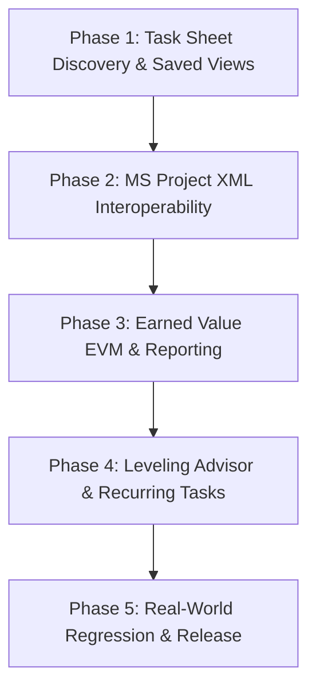

# Timebox v1.6 Pre-Implementation Design Review & Engineering Gate

**Date**: 2026-09-16  
**Document Status**: Final Design Gate Approval Document  
**Target Milestone**: Timebox v1.6 — The Professional Project Management Application  
**Prerequisites**: Timebox v1.5.0 Hardening Complete (142/142 Checks Passed, Frozen Production Baseline)  

---

## 1. Strategic Confirmation & Architecture Freeze

Timebox v1.5.0 is officially frozen as the production baseline. The canonical **Four-State Execution Lifecycle** is permanent and non-negotiable:

$$\text{Baseline} \longrightarrow \text{Current Planned Schedule} \longrightarrow \text{Actual Execution} \longrightarrow \text{Forecast}$$

### Canonical Invariants Maintained in v1.6
1. **Actuals Never Overwrite Plans**: Recording empirical actuals (`actualStart`, `actualFinish`, `actualWork`) does not modify planned dates (`plannedStart`, `plannedFinish`).
2. **Forecasts Never Overwrite Plans**: The forecast engine projects future outcomes from `statusDate` forward without altering user-planned dates.
3. **Plans Never Overwrite Baselines**: Updating the schedule or entering actuals never alters frozen snapshots in `project.baselines`.
4. **UI State Never Enters Project Markdown**: Search queries, filter selections, column widths, and Saved Views reside strictly in Obsidian plugin settings (`taskSheetPreferences`), keeping project Markdown files 100% clean of view state.
5. **No Sub-Day CPM Scheduling**: Macro project scheduling operates in calendar working days. Intraday minute scheduling belongs exclusively to Timebox daily notes.

**Current Code Status**: Zero production code has been modified; zero feature branches have been created. This document constitutes the formal pre-implementation design gate before Phase 1 implementation begins.

---

## 2. EVM Terminology Correction

Prior preliminary discovery notes inadvertently used informal shorthand equating actual work to actual cost. That error is formally struck from all Timebox specifications.

### Standard EVM Terminology Standardized
In accordance with Project Management Institute (PMI) PMBOK and ISO 21508 standards:

- **PV = Planned Value**: The authorized budget assigned to scheduled work. Also known as Budgeted Cost of Work Scheduled (BCWS).
- **EV = Earned Value**: The measure of work performed expressed in terms of the budget authorized for that work. Also known as Budgeted Cost of Work Performed (BCWP).
- **AC = Actual Cost**: The realized cost incurred for the work performed on an activity during a given time period. Also known as Actual Cost of Work Performed (ACWP).

$$\mathbf{Actual\ Work \ne Actual\ Cost}$$

- **Actual Work** is labor effort measured in **hours** ($\text{hours}$).
- **Actual Cost** is financial expenditure measured in **currency** ($\$$).

In Timebox, Actual Cost is mathematically derived from actual labor hours and resource billing rates:
$$\text{AC} = \sum_{a \in \text{assignments}} \text{actualWorkHours} \times \left(\frac{a.\text{units}}{\sum \text{units}}\right) \times \text{ratePerHour}$$

---

## 3. EVM Formula Definitions for Timebox v1.6

All Earned Value metrics in Timebox v1.6 are calculated dynamically from the normalized project model:

| EVM Metric | Formal Term | Standard Formula | Mathematical Definition in Timebox |
|:---|:---|:---:|:---|
| **BAC** | Budget at Completion | $\sum \text{Baseline Cost}$ | Total cost captured in active baseline snapshot. |
| **PV** | Planned Value (BCWS) | $\sum \text{Baseline Cost}_{\text{scheduled}}$ | Budgeted cost of all tasks scheduled to be completed on or before `statusDate`. |
| **EV** | Earned Value (BCWP) | $\sum (\text{Baseline Cost} \times \%_{\text{comp}})$ | Sum of baseline cost multiplied by task progress percentage ($\%_{\text{comp}} / 100$). |
| **AC** | Actual Cost (ACWP) | $\sum \text{Actual Cost}$ | Sum of realized actual cost derived from logged actual work hours and resource rates. |
| **SV** | Schedule Variance | $EV - PV$ | Schedule performance expressed in currency ($+$ ahead of plan, $-$ behind plan). |
| **CV** | Cost Variance | $EV - AC$ | Cost performance expressed in currency ($+$ under budget/savings, $-$ cost overrun). |
| **SPI** | Schedule Performance Index | $EV / PV$ | Efficiency ratio ($>1.0$ ahead of schedule, $<1.0$ behind schedule). |
| **CPI** | Cost Performance Index | $EV / AC$ | Cost efficiency ratio ($>1.0$ under budget/efficient, $<1.0$ over budget/inefficient). |
| **VAC** | Variance at Completion | $BAC - EAC$ | Expected final budget surplus ($+$) or deficit ($-$). |

---

## 4. Estimate at Completion (EAC) Methodology

In project controls, forecasting final project cost depends on the operational assumption made about future work efficiency. Timebox v1.6 implements a clear, deterministic hierarchy:

### 4.1 Primary Forecasting Methodology: Typical Cost Variance
By default, Timebox implements the standard PMBOK / Microsoft Project forecasting method assuming future work will continue at the cost efficiency established to date:

$$EAC_{\text{typical}} = \frac{BAC}{CPI}$$

- **Applicability**: Active projects with established progress where cost overruns or savings reflect permanent systemic productivity rates.

### 4.2 Boundary & Fallback Conditions
1. **Unstarted Projects ($AC = 0$ and $EV = 0$)**:
   - $CPI$ is undefined ($1.0$). $EAC$ falls back to $BAC$:
     $$EAC = BAC$$
2. **Distorted Performance Boundary ($CPI \le 0.1$ or extreme division)**:
   - If minimal progress has yielded massive expenditure, dividing by near-zero $CPI$ distorts reality. When $CPI \le 0.1$, the engine caps $EAC$ using the atypical variance model:
     $$EAC = AC + (BAC - EV)$$

### 4.3 Optional Forecasting Methodology: Composite Schedule & Cost Impact
For schedule-critical projects where delays directly inflate overhead and burn rates, Timebox provides an optional project-level setting toggle (`eacMethod: 'composite'`):

$$EAC_{\text{composite}} = AC + \frac{BAC - EV}{CPI \times SPI}$$

- **Impact**: Both cost inefficiency ($CPI$) and schedule slippage ($SPI$) compound the remaining work forecast, providing realistic worst-case forecasting for infrastructure and contractor engagements.

---

## 5. Microsoft Project XML Interoperability Scope Summary

Detailed in [v1.6 XML Interoperability Scope](file:///Volumes/1TBDock/ZS-Projects/Obsidian/timebox-plugin/O-Timebox-Daily/docs/roadmap/v1.6-xml-interoperability-scope.md):

- **Supported Subset**: Tasks, WBS outline depths, summary phases, milestones, durations (ISO `PT40H0M0S`), planned dates, 4 dependency types (`FS`, `SS`, `FF`, `SF`) with lead/lag, 8 constraint types, calendars, resources, assignment units, work, cost, baselines 0–10, actual starts, actual finishes, actual work, and percent complete.
- **Ignored / Excluded**: Proprietary enterprise server URL bindings, VBA macro scripts, custom ribbon XML, time-phased split task fragments, and COM automation.
- **Sovereignty**: Imported files convert to standard Markdown checklists and YAML frontmatter. No binary or sidecar database is introduced.

---

## 6. Phase 1 Architecture: Task Sheet Discovery & Saved Views

Detailed in [v1.6 Phase 1 Technical Design](file:///Volumes/1TBDock/ZS-Projects/Obsidian/timebox-plugin/O-Timebox-Daily/docs/roadmap/v1.6-phase1-task-discovery-design.md):

### In-Memory Transformation Pipeline
$$\text{NormalizedProject} \longrightarrow \text{Filter Engine} \longrightarrow \text{Grouping Engine} \longrightarrow \text{DOM Fragment Render}$$

- **Zero Markdown Mutations**: Search, filtering, grouping, and view switching do not trigger file saves or vault modification events.
- **Decoupled State**: Filter state is ephemeral per view instance; Saved Views persist across sessions in Obsidian plugin settings.

---

## 7. Task Sheet Discovery UX Specification

The Task Sheet toolbar receives an ergonomic discovery deck:
- **Search Bar**: Debounced text search with instant `Esc` clearing and `Cmd+F` focus.
- **Quick-Filter Chips**:
  - `( All )`: Reset filter state.
  - `[⚡ Critical]`: Filters for driving critical path tasks ($TF \le 0$).
  - `[⚠️ Slipped]`: Filters for tasks delayed relative to active baseline ($finishVariance > 0$) or forecast.
  - `[👤 My Tasks]`: Filters for tasks assigned to the user designated in settings.
  - `[🚩 Milestones]`: Filters for zero-duration milestone checkpoints.
  - `[Unassigned]`: Isolates unallocated work packages.
- **Dropdown Filters**: Resource filter select and Status filter select (`Not Started`, `In Progress`, `Completed`).
- **Grouping Segments**: `(• WBS)` `( Resource )` `( Status )`.
- **Status Readout**: `Showing X of Y tasks (Z hidden)`.

---

## 8. Saved Views Specification

Saved Views are persistent configurations that pair a specific **Filter State**, **Visible Column Set**, and **Grouping Mode**:

### Default System Presets
1. **All Tasks (Default)**: WBS view, core columns, all tasks visible.
2. **My Open Tasks**: Grouped by status, incomplete tasks assigned to user.
3. **Critical Tasks**: WBS view, core + float columns, $TF \le 0$.
4. **Slipped Tasks**: WBS view, baseline & variance columns, finish variance $>0$.
5. **Milestones**: WBS view, core + predecessor columns, milestones only.
6. **Tracking & Variance**: WBS view, baseline + execution columns, all tasks.

### Storage Isolation
Saved Views are serialized under `taskSheetPreferences.savedViews` in `data.json` (Obsidian plugin settings). They are **forbidden** from being written to project Markdown files.

---

## 9. Performance Strategy Across Scales

| Task Count | Processing Time | Memory Overhead | Rendering Strategy |
|:---:|:---:|:---:|:---|
| **100 Tasks** | $<1\text{ms}$ | Minimal ($<100\text{KB}$) | Full DocumentFragment table rebuild. |
| **500 Tasks** | $<3\text{ms}$ | Minimal ($<500\text{KB}$) | DocumentFragment batch DOM replacement. |
| **1,000 Tasks** | $<8\text{ms}$ | Low ($<1.2\text{MB}$) | CSS row visibility toggling (`display: none`) on cached DOM elements. |
| **5,000 Tasks** | $<25\text{ms}$ | Moderate ($<6\text{MB}$) | Pre-tokenized lower-case lookup map; viewport row slicing. |

- **Zero Markdown Parsing**: Search and filtering operate entirely on the cached `NormalizedProject`.
- **Zero CPM Recalculations**: Float and schedule dates are reused from the active scheduling cache.

---

## 10. Data Model Review: Zero Markdown Schema Impact

Phase 1 introduces **no schema changes** to project Markdown files:
- Project YAML frontmatter schema remains identical to v1.5.0.
- Task checklist syntax (`- [ ]`, `🛫`, `📅`, `⏳`, `dependsOn::`, `@resource`, `[%::]`, `[actualStart::]`) remains identical.
- All Phase 1 preferences persist in plugin settings:
  ```typescript
  plugin.settings.taskSheetPreferences = {
      visibleColumnIds: string[];
      currentUserId: string;
      savedViews: SavedViewDefinition[];
      activeSavedViewId: string;
  };
  ```

---

## 11. Timebox Integration & Dual-Layer Bridge

The boundary between macro project management and personal daily timeboxing is maintained:

```
+-------------------------------------------------------------------------+
| MACRO LAYER: Project Note                                               |
| - 55 tasks, WBS, CPM critical path, baselines, status date forecast.    |
| - Scheduled in calendar days.                                           |
+-------------------------------------------------------------------------+
                                    │
                       Click [+ Today] Injection
                                    ▼
+-------------------------------------------------------------------------+
| CLEAN BRIDGE:                                                           |
| - stripProjectMetadata cleans all PM tokens from injected text.         |
| - Task line in Daily Note: "- [ ] 2.2.1 Deep Foundation Trenching"      |
+-------------------------------------------------------------------------+
                                    │
                         User checks off task
                                    ▼
+-------------------------------------------------------------------------+
| MICRO LAYER: Daily Execution & Sync                                     |
| - Daily note records checkbox check: "- [x]".                           |
| - Bi-directional sync updates Project Note task:                        |
|   "- [x] 2.2.1 Deep Foundation Trenching [%:: 100] [actualFinish:: Today]"|
| - Planned dates, baseline, and daily note formatting remain untouched.  |
+-------------------------------------------------------------------------+
```

---

## 12. Implementation Dependencies & Phased Order



1. **Phase 1** is self-contained and touches only view-layer UI components and plugin settings.
2. **Phase 2** introduces the standalone XML parser/exporter without modifying core scheduling.
3. **Phase 3** builds on the validated cost model to expose EVM metrics and markdown reporting.
4. **Phase 4** introduces scheduling assistance (leveling advisor and recurring task generator).
5. **Phase 5** validates the entire release across unit, integration, and real-world suites.

---

## 13. Risk Management & Mitigations

| Risk Factor | Probability | Impact | Mitigation Strategy |
|:---|:---:|:---:|:---|
| **UI Clutter in Task Sheet** | Medium | Medium | Compact secondary filter toolbar; collapsible discovery deck; simple clear-all action. |
| **Search Latency on 1,000+ Tasks** | Low | Medium | 150ms input debounce; pre-computed lower-case search tokens. |
| **Saved View Schema Drift** | Low | Low | Schema versioning in plugin settings with safe fallback to system presets. |
| **XML Schema Incompatibilities** | Medium | High | Loss-tolerant XML DOM parsing; bypass unrecognized Microsoft enterprise tags. |
| **EVM Divide-by-Zero Errors** | Low | High | Strict boundary checking ($CPI = 1.0$ when $AC = 0$; $SPI = 1.0$ when $PV = 0$). |

---

## 14. Testing & Verification Strategy

Before any v1.6 phase is marked complete, it must pass three verification tiers:
1. **Automated Unit Tests**:
   - `test/taskDiscovery.test.ts`: Search matching, filter evaluation, grouping partitions.
   - `test/savedViews.test.ts`: Settings persistence and view application.
   - `test/evmEngine.test.ts`: Mathematical validation of $PV, EV, AC, SV, CV, SPI, CPI, EAC$.
   - `test/xmlInteroperability.test.ts`: Bidirectional import/export fidelity.
2. **Regression Integrity**:
   - All 21 existing unit tests and 14 acceptance tests must continue to pass with 0 regressions.
3. **Real-World Usability Walkthrough**:
   - Executed against the 55-task Commercial Facility Buildout fixture in Obsidian desktop.

---

## 15. Phase 1 Entry Criteria & Sign-Off

The engineering prerequisites for beginning Phase 1 implementation are:
- [x] All 142 v1.5 hardening checks passed and verified.
- [x] Four-State Lifecycle Invariant canonically frozen.
- [x] EVM terminology and mathematical formulas corrected and documented.
- [x] EAC forecasting methodology explicitly specified.
- [x] MS Project XML interoperability subset strictly defined.
- [x] Phase 1 Task Sheet Discovery and Saved Views design completed.
- [x] Proof of zero Markdown schema changes established.
- [x] Timebox dual-layer boundary isolation confirmed.
- [ ] User approval to begin Phase 1 implementation.
