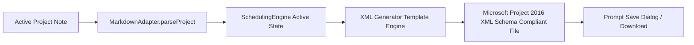

# Timebox v1.6 Industry Interoperability Scope: Microsoft Project XML

**Date**: 2026-09-16  
**Document Status**: Pre-Implementation Design Specification  
**Target Milestone**: Timebox v1.6 — Phase 2  
**Scope**: Bidirectional Microsoft Project XML (`.xml`) Import and Export Specification  

---

## 1. Executive Position on Interoperability

Timebox does **not** claim full, byte-for-byte binary parity with Microsoft Project's proprietary enterprise ecosystem. Microsoft Project contains thousands of legacy schema tags, enterprise custom fields, COM add-ins, OLAP cubes, and VBA macro scripts that have no place in a clean, local-first Markdown knowledge base.

Instead, Timebox v1.6 defines a **strict, high-fidelity interoperability SUBSET**. This subset focuses exclusively on standard project management core data: **Work Breakdown Structure, topological dependencies, calendars, working day durations, constraints, resource assignments, multi-baselines, and execution actuals**.

### Guiding Principles
1. **The Normalized Model is the Source of Truth**: All XML imports are parsed directly into Timebox's `NormalizedProject` model and serialized into standard Markdown checklists and YAML frontmatter.
2. **Zero Sidecar Databases**: No SQLite, JSON caches, or binary sidecars are created during import or export.
3. **Loss-Tolerant Parsing**: Unrecognized enterprise tags in imported XML files are safely bypassed without crashing or corrupting data.
4. **Deterministic Round-Trip**: A project created in Timebox, exported to XML, and re-imported into Timebox or ProjectLibre produces an identical CPM schedule network.

---

## 2. Comprehensive XML Entity Support Matrix

Each XML entity in the Microsoft Project schema (`http://schemas.microsoft.com/project`) is classified into one of four objective tiers:

- **SUPPORTED**: Fully mapped bidirectionally between MS Project XML and Timebox.
- **PARTIALLY SUPPORTED**: Essential data mapped; minor formatting or enterprise nuances omitted.
- **IGNORED**: Safely skipped during import without error; omitted on export.
- **NOT SUPPORTED**: Intentionally excluded due to philosophical conflict with Timebox principles.

| XML Entity / Domain | MS Project Schema Element | Timebox v1.6 Status | Mapping & Implementation Details |
|:---|:---|:---:|:---|
| **Project Properties** | `<Project>`, `<Name>`, `<StartDate>`, `<FinishDate>` | **SUPPORTED** | Mapped to note title, `projectStartDate`, and `deadline` in YAML frontmatter. |
| **Task Definitions** | `<Task>`, `<UID>`, `<ID>`, `<Name>`, `<Active>` | **SUPPORTED** | Mapped to checklist items (`- [ ] Task Title`). UIDs mapped to task IDs. |
| **WBS & Outline Level** | `<OutlineLevel>`, `<OutlineNumber>`, `<WBS>` | **SUPPORTED** | Mapped directly to Markdown checklist indentation depth and computed WBS codes. |
| **Summary Phases** | `
`, `<Children>` | **SUPPORTED** | Tasks with child indentation marked as summary tasks; rollups calculated dynamically. |
| **Milestones** | `<Milestone>1</Milestone>` | **SUPPORTED** | Mapped to `#milestone` tag or `⏳ 0d`. Rendered as milestone diamonds. |
| **Task Duration** | `<Duration>`, `<DurationFormat>` | **SUPPORTED** | Standard ISO format (e.g. `PT40H0M0S` $\implies$ 5 working days). Mapped to `⏳ Nd`. |
| **Planned Start / Finish**| `<Start>`, `<Finish>` | **SUPPORTED** | Mapped to `🛫 YYYY-MM-DD` and `📅 YYYY-MM-DD`. |
| **Dependencies** | `<PredecessorLink>`, `<Type>` | **SUPPORTED** | Supported across all 4 types: `1=FF`, `2=FS`, `3=SF`, `4=SS`. Mapped to `dependsOn::`. |
| **Dependency Lag / Lead**| `<LinkLag>`, `<LagFormat>` | **SUPPORTED** | Lag in working day tenths converted to calendar days (e.g. `1FS+2d`, `2SS-1d`). |
| **Scheduling Constraints**| `<ConstraintType>`, `<ConstraintDate>` | **SUPPORTED** | ASAP (0), ALAP (1), SNET (2), SNLT (3), FNET (4), FNLT (5), MSO (6), MFO (7). Mapped to `[constraint:: type date]`. |
| **Project Calendars** | `<Calendar>`, `<WeekDays>`, `<Exceptions>` | **SUPPORTED** | Mapped to `calendars:` YAML frontmatter array (working days, hours, holidays, exceptions). |
| **Task Calendars** | `<Task><CalendarUID>` | **PARTIALLY SUPPORTED** | Mapped to `task.calendarId` when custom calendar exists in project. |
| **Resource Definitions**| `<Resource>`, `<UID>`, `<Name>`, `<Type>` | **SUPPORTED** | Mapped to `resources:` frontmatter (Work, Material, Cost) with hourly billing rates. |
| **Resource Assignments** | `<Assignment>`, `<TaskUID>`, `<ResourceUID>`, `<Units>`| **SUPPORTED** | Mapped to `@resource-id` inline tokens with assignment units. |
| **Planned Work** | `<Work>` | **SUPPORTED** | Work hours (e.g. `PT80H0M0S`) calculated via duration $\times$ hours $\times$ units. |
| **Planned Cost** | `<Cost>` | **SUPPORTED** | Derived from assigned resource billing rates and work hours. |
| **Baselines (0..10)** | `<Baseline Number="0">`, `<Start>`, `<Finish>`, `<Work>`, `<Cost>` | **SUPPORTED** | Mapped to `baselines:` frontmatter snapshots (supports Baseline 0 through 10). |
| **Actual Start / Finish**| `<ActualStart>`, `<ActualFinish>` | **SUPPORTED** | Mapped to `[actualStart:: YYYY-MM-DD]` and `[actualFinish:: YYYY-MM-DD]`. |
| **Actual Work** | `<ActualWork>` | **SUPPORTED** | Mapped to `[actualWork:: Nh]`. |
| **Percent Complete** | `<PercentComplete>`, `<PercentWorkComplete>` | **SUPPORTED** | Mapped to `[%:: N]` and `- [x]` checklist state. |
| **Task Priority** | `<Priority>` (100–1000) | **PARTIALLY SUPPORTED** | Mapped to `[priority:: low\|normal\|high]`. MS Project 500 = normal. |
| **Task Notes** | `<Notes>` | **SUPPORTED** | Multi-line text mapped to sub-bullet notes beneath the Markdown task line. |
| **Custom Fields** | `<ExtendedAttribute>` | **PARTIALLY SUPPORTED** | Custom text fields preserved as Dataview inline tokens `[key:: value]`. |
| **Task Splitting** | `<TimephasedData>` | **NOT SUPPORTED** | Incompatible with atomic Markdown checklist line representation. |
| **Enterprise Resources**| `<EnterpriseResourcePool>` | **IGNORED** | Server-side active directory bindings skipped cleanly. |
| **VBA Code / Macros** | `<VBA>` | **IGNORED** | Proprietary executable macros skipped cleanly. |
| **Gantt Bar Styles** | `<Views>`, `<Styles>` | **IGNORED** | Proprietary color styling skipped; Timebox uses native Obsidian theme styling. |

---

## 3. Import Architecture: XML $\to$ Markdown Note

### 3.1 Step-by-Step Import Workflow
1. **User Invocation**: User clicks ribbon icon or executes command: `Timebox: Import MS Project XML`.
2. **File Selection**: Native file picker allows selecting `.xml` files exported from Microsoft Project, ProjectLibre, or OmniPlan.
3. **XML Normalization**:
   - Parses `<Project>`, `<Calendars>`, `<Tasks>`, `<Resources>`, `<Assignments>`, and `<Baselines>`.
   - Converts Microsoft duration strings (`PT40H0M0S`) to integer working days.
   - Converts Microsoft predecessor types (1, 2, 3, 4) into standard dependency tokens (`FF`, `FS`, `SF`, `SS`).
4. **CPM Engine Pass**: The imported project is passed through `SchedulingEngine.scheduleProject()` to verify network integrity and compute float.
5. **Vault Note Generation**: Creates a new note (e.g. `TimeBox/Projects/Imported Project.md`) containing clean YAML frontmatter and standard checklist items.

---

## 4. Export Architecture: Markdown Note $\to$ MS Project XML

### 4.1 Export Validation & Compliance
- **Schema Compliance**: Generates XML strictly conforming to the Microsoft Project 2007/2010/2016 XML Data Interchange Schema.
- **Duration Representation**: Durations exported in standard ISO 8601 duration format (`PT{hours}H0M0S`).
- **Dependency Links**: Outputs full `<PredecessorLink>` blocks with explicit `PredecessorUID`, `Type`, and `LinkLag`.
- **Baselines**: Exports active baseline as `<Baseline Number="0">`, and historical baselines 1–10 as respective baseline blocks.
- **Execution Actuals**: Outputs `<ActualStart>`, `<ActualFinish>`, `<ActualWork>`, and `<PercentComplete>`.

---

## 5. Round-Trip Verification & Lossless Guarantees

### What is Guaranteed to Round-Trip Losslessly:
- Complete WBS outline structure and hierarchy levels.
- All 4 dependency relationship types with calendar-aware lag and lead.
- Task durations, working days, and milestone designations.
- Project start date and finish deadline.
- Full working calendar definitions (working days, custom hours, holidays).
- Resource directory, hourly billing rates, and task assignment units.
- Multi-baseline snapshots (0 through 10) with original baseline dates.
- Actual start dates, actual finish dates, actual work hours, and percent complete.

### What is Intentionally Dropped / Ignored:
- Microsoft Office ribbon interface custom settings.
- VBA macros and COM automation scripts.
- Proprietary enterprise resource pool server URLs.
- Timephased daily timesheet splices (Timebox models total actual work).

---

## 6. Automated Testing Plan for Interoperability

1. **Fixture Tests (`test/xmlInteroperability.test.ts`)**:
   - Import standard MS Project 2016 export fixture.
   - Verify all 55 tasks, WBS depths, dependencies, resources, and baselines match expected model values.
2. **Round-Trip Test**:
   - `Timebox Model ➔ Export XML ➔ Re-Import XML ➔ Verify Model Equality`.
   - Proves zero date drift, zero float distortion, and zero dependency drop.
3. **Third-Party Compatibility Verification**:
   - Verify exported XML opens cleanly in **ProjectLibre** (open-source benchmark) without validation warnings.
